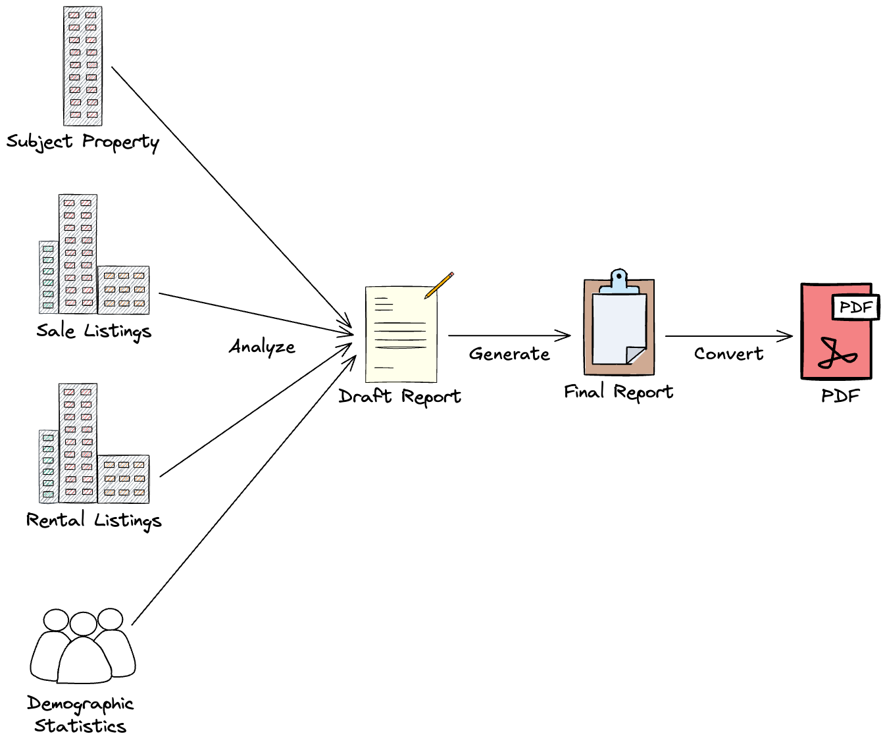
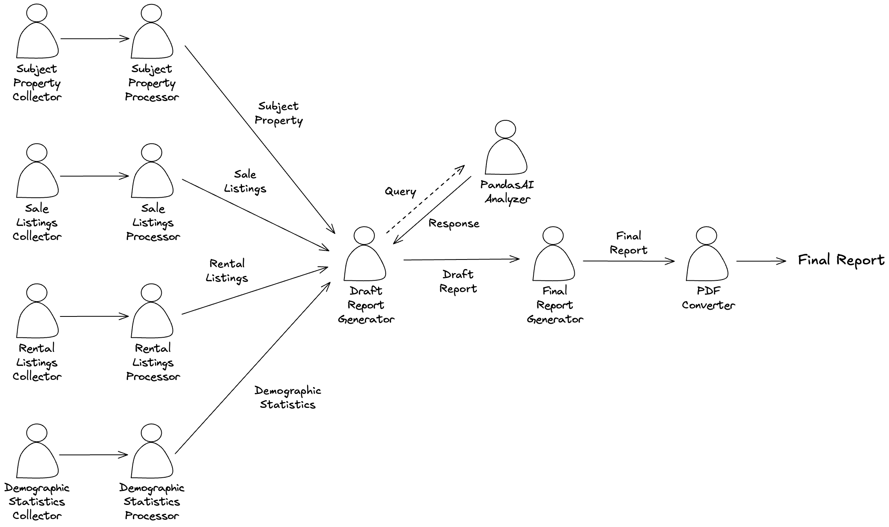

# Automated Property Submarket Analysis

## Overview
This project implements an AI workflow for **Property Submarket Analysis**, using LangGraph.


## Setup

### Requirements
- Python 3.11
- RentCast API Key
- ArcGIS Username/Password
- OpenAI API Key

### Environment Variables
Copy the `.env.sample` file to `.env` and fill in your API keys:
```
cp .env.sample .env
```
Then edit `.env`:
```
RENTCAST_API_KEY=your-rentcast-api-key
ARCGIS_USERNAME=your-arcgis-username
ARCGIS_PASSWORD=your-arcgis-password
OPENAI_API_KEY=your-openai-api-key
```

### Installation
```
pip install -r requirements.txt
```

## Usage

### Launch Demo
```
streamlit run app.py
```

### Run Test
```
python test.py
```

## Workflow


## Files
- `data/`: Test cases
- `output/`: Report files
- `state.py`: State definitions
- `nodes.py`: Node definitions
- `tools.py`: Tool definitions
- `prompts.py`: Prompt templates
- `workflow.py`: Workflow definition
- `config.py`: Config loader 
- `app.py`: Streamlit demo
- `test.py`: Test script